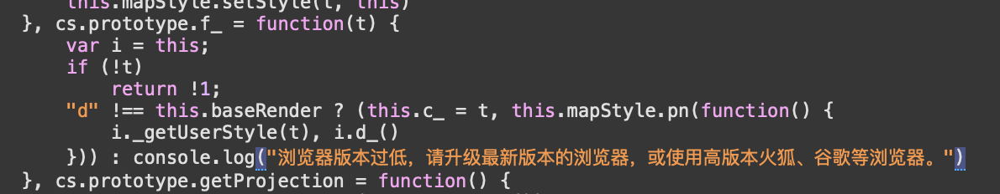

背景：iOS原生调用H5页面，修改H5中的高德地图样式（默认样式，修改为自定义样式）和加载方式（默认2D，修改为3D）。

问题：使用UIWebView和WKWebView都无法修改成功，但SFSafariViewController可以成功。

过程：

- 使用Mac中自带的手机模拟器，本地调试H5页面。

- 浏览器打开开发环境或测试环境的H5页面。

- 由电脑端safari浏览器工具查看网页检查器，网页检查器打开方式：开发→模拟器-"模拟器名称"→localhost--index

    

- 点击模拟器中的按钮，加载自定义样式，开发支持→web端→地图 JS API→自定义地图/3D地图，相关代码如下

    ```javascript
    var map = new AMap.Map('container',{
        zoom: 10, //设置地图的缩放级别
    });
    map.setMapStyle('amap://styles/地图样式ID');
    ```

- 在网页检查器中查看请求的内容，会报错，报错内容：浏览器版本过低，请升级最新版本的浏览器，或使用高版本火狐、谷歌等浏览器。查看相关源码文件，可查看到内容：

    

    

    向上查看`code`逻辑，有如下判断条件：

    ```javascript
    byWebgl = window.Uint8Array && enableVector && !window.forbidenWebGL && canWebGL && (window.forceWebGL || (chrome30plus || firefox27plus || safari7plus || edge || wechat || dingding) && "other" !== plat_1)
    ```

该`.js`文件需要加载需要支持`WebGL`，所以一开始定位是觉得可能`WKWebView`不支持`WebGL`或者说未开启`WKWebView`。经过官方接口文档和其他网站资料，未发现任何关于`WebGL`的支持开关和接口，而且基于`safari`是可以支持`WebGL`的，以及一些资料发现`WKWebView`是支持`WebGL`的，那么问题应该不在于支不支持`WebGL`上。

既然问题不是出在`WKWebView`上，只能考虑上述判断语句中间的判断条件

```javascript
window.forceWebGL || (chrome30plus || firefox27plus || safari7plus || edge || wechat || dingding)
```

尝试将挂载在`window`上的`forceWebGL`置为`true`，是否就能支持了。发现修改之后还是无法成功。

本来打算就此放弃，坐等高德的工单回复。后来某全栈大佬觉得既然微信、钉钉、safari都出现在判断中，那是否可以抓取这些客户端调起h5对应的`useragent`（即设备调用H5时，需要传给服务器操作系统及版本相关信息），修改我们`WKWebView`的`useragent`是否有效。

尝试使用微信的`micromessager`来修改`useragent`：

```objective-c
	[self.webView evaluateJavaScript:@"navigator.userAgent" completionHandler:^(id _Nullable result, NSError * _Nullable error) {
		NSString *userAgent = result;
		NSString *newUserAgent = [userAgent stringByAppendingString:@" micromessenger"];
		NSDictionary *dictionary = [NSDictionary dictionaryWithObjectsAndKeys:newUserAgent, @"UserAgent", nil];
		[[NSUserDefaults standardUserDefaults] registerDefaults:dictionary];
		[[NSUserDefaults standardUserDefaults] synchronize];
		if (@available(iOS 9.0, *)) {
			[self->_webView setCustomUserAgent:newUserAgent];
		} else {
			// Fallback on earlier versions
		}
	}];
```

尝试结果有效，估计高德的判断比较保守，只有一些特定的`useragent`才能彻底支持3D和自定义样式。


 

